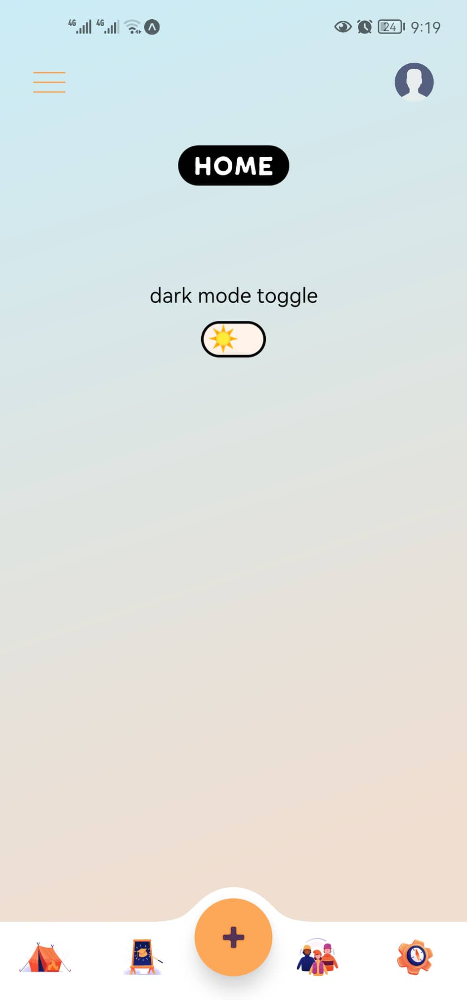
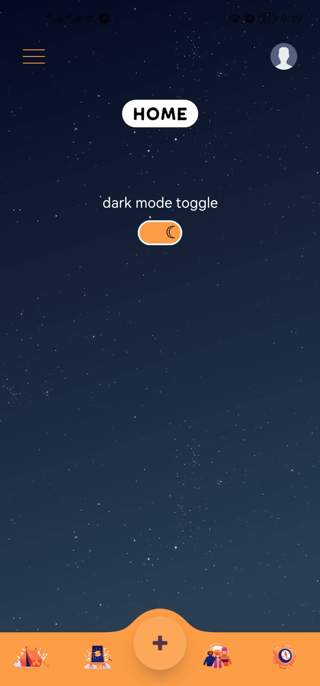
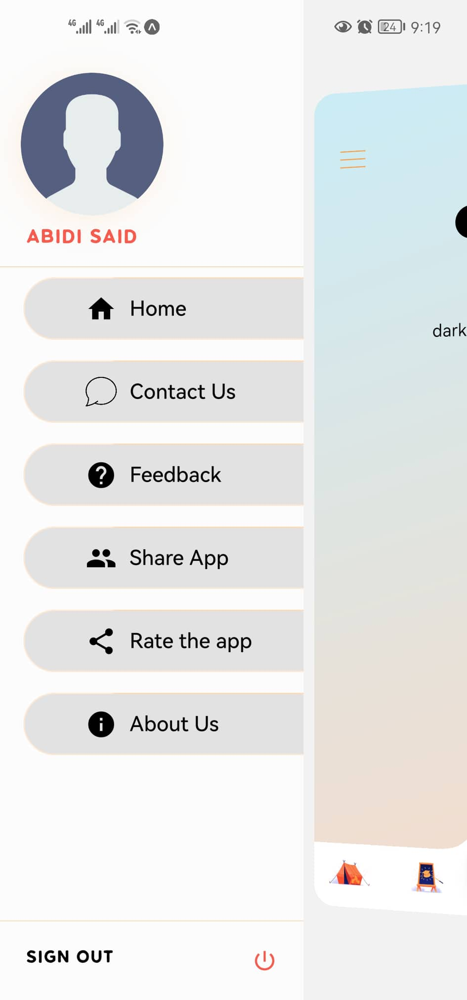

<div align="center">
  <h2>React Native Starter App</h2>
  <i>React Native Starter App with Stunning Animated Drawer and Awesome Bottom Menu</i>
 <br/>
<br />
</div>
<div align="center">



</div>
<br/>
This React Native app starter provides a solid foundation for building mobile applications with stunning animated drawers, an awesome bottom menu, dark mode switcher, and internationalization support using the i18-js translation library. This project is built on the Expo framework, making it easy to get started with React Native development.
<br/><br/>
<b>Feel free to customize and build upon this starter to create your own amazing React Native applications. If you have any questions or encounter issues, please don't hesitate to reach out to me. Happy coding!</b>

<!-- Add a horizontal rule for separation -->
<hr/>

## :fast_forward: Quick Links

- [:book: What is included](#heading-1)
- [:rocket: Features](#heading-2)
- [:wrench: Setup & Documentation](#heading-3)
- [:email: Contact Me](#heading-4)

<!-- Add a horizontal rule for separation -->
<hr/>

## :question: What is included: <a id="heading-1"></a>

This React Native app starter comes with a range of features to help you kickstart your mobile app development:

### Stunning Animated Drawer

The app includes a beautifully animated drawer that provides easy navigation for your users. It's highly customizable and can be adapted to fit your app's branding and style.

### Awesome Bottom Menu

The bottom menu offers quick access to essential app features and navigation options. It's designed to enhance user experience and make your app more user-friendly.

### Dark Mode Switcher

Toggle between light and dark mode with the integrated dark mode switcher. Give your users the flexibility to choose their preferred app appearance.

### i18-js Translation Library

The i18-js library is integrated into this starter, allowing you to easily internationalize your app by adding translations for different languages. It's a powerful tool for making your app accessible to a global audience.

## :fire: Features: <a id="heading-2"></a>

- Stunning Animated Drawer
- Awesome Bottom Menu
- Dark Mode Switcher
- Internationalization Support with i18-js
- Built on Expo Framework for Rapid Development
- Easily Customizable and Extendable
- Beautiful colors inspired from nature

## :book: Documentation <a id="heading-3"></a>

**[> Expo](https://expo.dev/)**<br/>
**[> React Native](https://reactnative.dev/)**

<h3>1. Clone the Repository</h3>Clone this repository to your local machine using the following command:<br><br>

```bash
 git clone https://github.com/abidi-said/react-native-starter-app.git
```

<h3>2. Install Dependencies</h3>Navigate to the project directory and install the necessary dependencies using yarn:<br><br>

```bash
 cd react-native-starter-app
 yarn install
 # or
 npx expo install
```

<h3>3. Start the Expo Development Server</h3>Start the Expo development server by running:<br><br>

```bash
 yarn start
 # or
 npx expo start
```

## :mailbox_with_mail: Contact Me: <a id="heading-4"></a>

abidi.said2010@gmail.com
